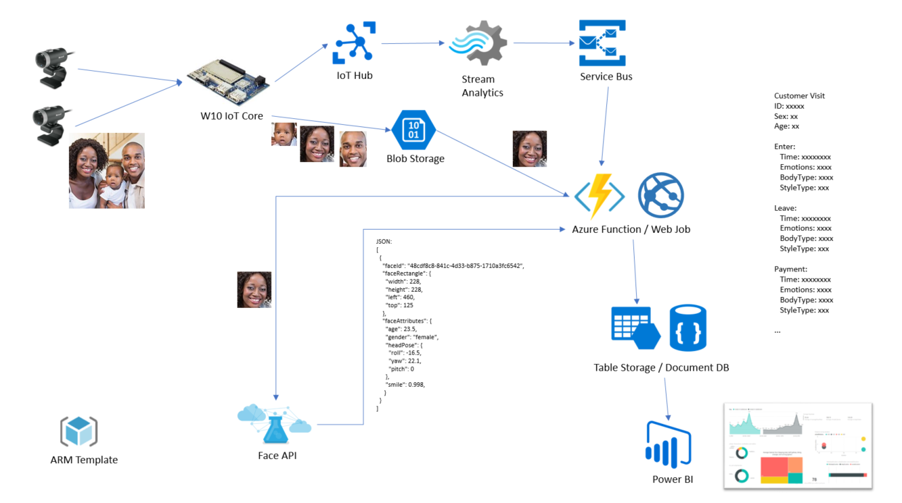
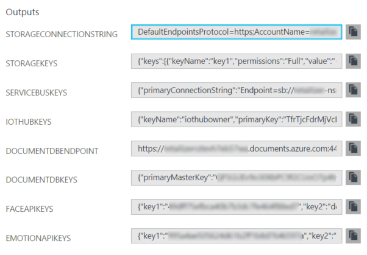
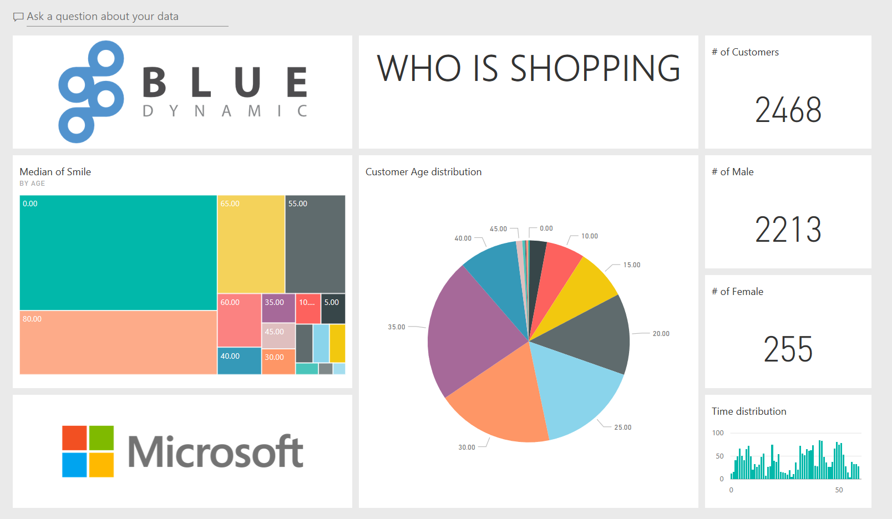

# Technical Case Study - BlueDynamic

Microsoft teamed up with [Blue Dynamic](http://bluedynamic.cz/) for a hackfest to create a proof of concept of a new product. The scope was following:

* capture customer faces from a camera
* do real time counting and advanced analysis of captured faces
* provide outputs for other systems and UI


## Overview

The project was divided into three main parts:

1. **Data capture**: UWP background app running on Windows 10 IoT Core powered microcomputer which continuously analyzes connected camera(s), looking for faces. If detected crop them and send to Azure IoT Hub and Azure Storage.

2. **Data transformation**: Cloud infrastructure for background processing. We combined Azure IoT Hub, Cognitive Services, Azure Storage, Web Jobs, Service Bus and API Apps (see schema below). The output of the process is information about recognized person: emotion, sex, age and face identification.

3. **Data visualization**: We designed a Power BI dashboard to visualize captured data.

Schema overview:

 

 ## Solution, steps and delivery

We decided to use Retailizer as a code name for this project. Let’s take a deep dive into solution technical details. We will go through the process from a person standing in front of a camera, all the way to the cloud and Power BI at the end. 

### UWP App
We begin with an UWP app running on IoT device (DragonBoard in our case). We decided that there’s no need for UI on the app itself and therefore chose Background Application (IoT) as our Visual Studio template. It’s technically a background task with one mandatory method: Run, which does all the work.

First, we initialize each camera connected to the board’s USB ports and add it’s MediaCapture object to a collection. Then we start an infinite loop which tries to capture and process pictures from the camera as fast as possible. 

Why using images instead of video detection? We experimented with both approaches and at the end decided for taking photos, mostly because of lower CPU consumption and better scalability to several cameras.

These are operations we do in each round for each camera:
1. Capture a photo.
2. Detect if there are any faces on the photo.
3. Extract and crop each face from the photo.
4. Send face images to blob storage.
5. Send message to IoT Hub.

The key part is that we **detect faces locally**, if supported, **before sending data to the server** to offload some processing from the API. We also optimize the size of transferred data by extracting only the necessary portion of person’s face. (Both tasks happen in *LocalFaceDetector.cs*.)

 

UWP app’s work for each frame ends by uploading cropped face to Azure Storage Blob and a message to Azure IoT Hub. Even though the IoT Hub SDK supports uploading to Blob Storage, there were no version for UWP on IoT Core, so we had to place two separate calls – first using Azure Storage SDK, second with IoT Hub SDK.

IoT Hub message payload contains three main pieces of information:

* **Device ID** – which device is sending the data. It is a unique identifier of the DragonBoard, assigned by server during registration process.
* **Blob Name** – name of the file we uploaded to Blob Storage – JPG image with the person’s face.
* **Camera ID** – since each device can have multiple cameras connected to it, we use *VideoDeviceId* to distinguish them.

Every device needs to be registered with the server before it can push data to IoT Hub. Registration happens automatically when creating a Device Client – a request is sent to our backend API which returns a corresponding Device Key. This key is then used to authenticate with IoT Hub. (See *DeviceConfiguration.cs* for more details.) This step can be optionally done by calling Azure function.

### IoT Hub, Stream Analytics
IoT hub is used as reliable and scalable broker for device messages. Which can pass messages directly to Azure Stream Analytics. It also acts as temporally queue in case processing part(s) are on hold or being updated. Some basic deduplication can be also done here.

### Web Job
Now we need to transform basic data we have in Service Bus into something we call “Event” and then assign it to a “Visit”. The idea here is to use Cognitive Services APIs to determine how old is the person whose face we have captured, what mood are they in, translate which camera captured them from technical ID to type which our business logic can understand and persist this new object to DocumentDB.

We initially decided to use Azure WebJobs and set up a queue trigger so that every time new message arrives to Service Bus, Web Job fires up and starts processing.

1. Download face image from Blob Storage.
2. Send it to Face Detection API.
3. Get back information about the detected face – Age, Gender and Smile.
4. Send face image to Face Identification API.
5. Assign face to an identified person or create new one (in case this is the first time we see this face).
6. Fill the Event object.
7. Pair with corresponding Visit object, or create new one.
8. Persist to DocumentDB.

After building the first prototype, we immediately hit the **cognitive API throttling** (as noted above, we’re sending faces as often as possible – if there are any – which can result in several calls per second). That’s why our *FaceApiService* wraps each call into a retry cycle. It begins with 1 second delay and doubles it on every retry until the call succeeds or passes 10 times. This solution is not ideal, since we’re hitting the Face API from parallel workers and the delay can easily go to maximum. Possible solution would be to use secondary API key and distribute the load, or implement smarter retry mechanism.

What’s also important to notice is that the **Cognitive Services SDK closes an image stream after it’s used**. We didn’t handle this properly at first and had issues with stream exceptions in the retry loop. This is very difficult to debug, **so watch carefully what’s going on with your streams**. We solved it by creating a copy of the stream every time our API service enters the retry loop.

```c#
return await RunTaskWithAutoRetryOnQuotaLimitExceededError(
  () =>
  {
      Stream copiedStream = new MemoryStream();
      imageStream.Seek(0, SeekOrigin.Begin);
      imageStream.CopyTo(copiedStream);
      copiedStream.Seek(0, SeekOrigin.Begin);
      return faceClient.DetectAsync(copiedStream, 
          returnFaceId, 
          returnFaceLandmarks, 
          returnFaceAttributes);
  });
```

Finally, we chose DocumentDB as our persistence layer because of the JSON structure it supports and the possibility to use SQL-like commands for retrieving and filtering data. As an alternative to optimize costs we also architecture a persistence layer built upon Table Storage, but that’s not part of the current solution.

### Azure Resource Manager Template
Since major part of our solution runs on the Azure cloud, it was obvious to include an Azure Resource Manager (ARM) template as well. There are several benefits to it:

* Everyone from the team can create an exact copy of the production environment and test new features there.
* Infrastructure is represented as code and saved in source control system.
* Deployment to different environments (development, staging, production...) can be fully automated as part of the Continuous Integration (CI) pipeline.

Our template deploys two Cognitive Services APIs (Face and Emotion API), Web App for backend, Storage Account, IoT Hub, Service Bus with a Queue and Stream Analytics account. Once the deployment is done, the template returns connection strings that are needed in the application.

There are several approaches to template authoring – you can start from scratch, build upon a template from [GitHub](https://github.com/Azure/azure-quickstart-templates), or export your existing infrastructure directly from Azure. We did the latter and started with full template from Azure. Getting it is simple – just click Automation Script on your Resource Group and download ZIP file with the template and parameters.

When you open the template, you will notice that it’s very, very long. That’s because Azure exports complete definitions so that you can rebuild your infrastructure to the same state it was when exported. Since we don’t need this, we started cleaning it up.

First, we deleted most of the **parameters**. There’s only one left: *nameRoot*, all other dynamic values are defined as **variables** and constructed during deployment. This saves everyone from taking care about uniqueness and other name restrictions, such as:

* Storage Account name needs to be globally unique and can contain only letters or numbers.
* Web App name needs to be globally unique and can contain letters, numbers or hyphens.
* Queue name needs to be constant, because the app refers to it from code.
* Etc.

Variable definition can look like this:

```json
"variables": {
  "backendName": "[concat(parameters('nameRoot'), '-backend', uniqueString(subscription().subscriptionId))]",
  "faceApiName": "[concat(parameters('nameRoot'), '-face')]",
  ...
}
```

We relied heavily on great part of ARM template engine – functions. For example the `uniqueString(subscription().subscriptionId)` call makes sure that the name will be unique. If you wanted to be more strict, you could add more rules (such as length), but since our template is meant for developers, we didn’t go too thorough.

Other thing that needed fixing were dependencies. In our case the Queue cannot be created until there’s a Service Bus namespace ready. We tried that initially and deployments were failing. Adding dependsOn configuration fixed it:

```json
  "dependsOn": [
    "[resourceId('Microsoft.ServiceBus/namespaces', variables('serviceBusNamespaceName'))]"
  ]
```

Finally, with the deployment done we wanted to get connection strings and keys for individual services to use them right away in application code.

 

We achieved this by combining another nice function in the template engine, listKeys, with resource references. For example, the Connection String for Storage Account can be returned by setting up this output:

```json
"StorageConnectionString": {
  "value": "[concat('DefaultEndpointsProtocol=https;AccountName=', variables('storageAccountName'), ';AccountKey=', listKeys(resourceId('Microsoft.Storage/storageAccounts', variables('storageAccountName')), '2016-01-01').keys[0].value)]",
  "type": "string"
},
```

IoT Hub is an example of getting the key by asking for its name directly:

```json
"IotHubKeys": {
  "value": "[listKeys(resourceId('Microsoft.Devices/IotHubs/Iothubkeys', variables('iotHubName'), 'iothubowner'), '2016-02-03')]",
  "type": "object"
},
```

### Power BI
For demo purposes, we needed to have some visual output. So, we have created Power BI dashboard showing overall data gathered and processed by Retailizer, having no ambition to be used in production in any form.

 
