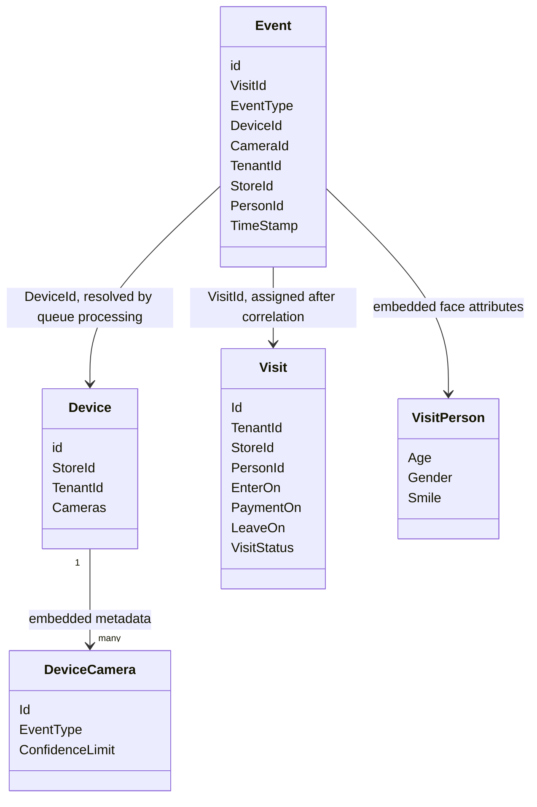

# Retailizer data and message model

| Identifier | Type name | Location | Technical purpose | Important fields | Identifiers | Relationships | Serialization | Persistence | Tenant/store scope | Mutable state | Observed invariant | Inferred invariant | Ambiguity | Verification requirement |
| --- | --- | --- | --- | --- | --- | --- | --- | --- | --- | --- | --- | --- | --- | --- |
| DATA-DEVICE-001 | `Device` | `Common/DTO/Device.cs` | Physical device metadata and camera mapping | `id`, `DeviceId`, `StoreId`, `TenantId`, `Cameras` | `id`/`DeviceId` share backing field; `DeviceId` ignored for JSON | Has many `DeviceCamera`; referenced by events | Newtonsoft JSON | Queried/upserted in DocumentDB devices collection | Carries tenant/store | Cameras and tenant/store can vary by document | Device lookup by `id` | Device records likely pre-seeded or maintained by initializer/operator | Backend registration does not persist full device metadata | Runtime/stakeholder verification |
| DATA-DEVICE-002 | `DeviceCamera` | `Common/DTO/DeviceCamera.cs` | Maps camera ID to event type and configured confidence | `Id`, `EventType`, `ConfidenceLimit` | `Id` | Embedded in `Device.Cameras` | POCO JSON | Embedded in device document | Inherits from device | Metadata only | Camera ID used to derive event type | Confidence limit may have been intended for identification threshold | Code uses hard-coded `0.8`, not `ConfidenceLimit` | Stakeholder verification |
| DATA-EVENT-001 | `Event` | `Common/DTO/Event.cs` | Processed observation/business event | `id`, `VisitId`, `EventType`, `DeviceId`, `CameraId`, `TenantId`, `StoreId`, `PersonId`, `TimeStamp`, `SuggestedPersonId`, `Confidence`, `Person` | `id` optional; `VisitId`; `PersonId` | Links to visit and embedded `VisitPerson` | POCO JSON | Created in DocumentDB events collection | Explicit fields copied from device | `VisitId` assigned after correlation | Event types include `enter`, `payment`, `leave` | Event should represent one processed face observation | First save can occur before `VisitId`; duplicate event risk | Runtime verification |
| DATA-EVENT-002 | `VisitPerson` | `Common/DTO/Event.cs` | Face-derived demographic/affect attributes embedded in event | `Age`, `Gender`, `Smile` | None | Embedded in `Event` | POCO JSON | Embedded in event document | Through event | Immutable after event creation in observed code | Values originate from Face API detection | Represents detected face attributes, not verified identity facts | Historical Face API semantics unavailable statically | External-service verification |
| DATA-VISIT-001 | `Visit` | `Common/DTO/Visit.cs` | Correlated customer visit lifecycle | `Id`, `RowKey`, `TenantId`, `StoreId`, `PersonId`, `SuggestedPersonId`, `Confidence`, `EnterOn`, `PaymentOn`, `LeaveOn`, `VisitStatus`, `PartitionKey` | `RowKey`/`Id`; generated GUID for new visits; `PartitionKey` derived from tenant/store/person | Linked from events via `VisitId` | TableEntity plus POCO properties | Written to DocumentDB visits collection by observed service | Explicit tenant/store/person | Payment/leave timestamps and status mutate | `Left` closes visit for lookup filter | Active visit means non-Left and non-None for same tenant/store/person | Inherits TableEntity despite DocumentDB persistence | Runtime/stakeholder verification |
| DATA-VISIT-002 | `VisitStatus` | `Common/DTO/Visit.cs` | Visit lifecycle enum | `None`, `Entered`, `Left` | Numeric enum values | Used by `Visit` and SQL filter | Likely JSON numeric by default | Stored in visit documents | None | Mutated to `Left` on leave | `Left` excluded from active lookup | `Entered` represents active visit | Exact serialization requires runtime check | Runtime verification |
| DATA-MSG-001 | Device-to-cloud message | `Retailizer.UWP/AzureImagePersister.cs` | Notify cloud that a face blob exists | `deviceId`, `blobName`, `cameraId` | Device ID and GUID blob name | References blob and device camera | Newtonsoft JSON encoded ASCII | Transient IoT Hub message | Tenant/store not included | None | Blob upload happens before message send | Consumer can resolve tenant/store from device doc | No version, schema, message ID, or timestamp | Runtime verification |
| DATA-MSG-002 | WebJob inbound message | `Reailizer.Job/Functions.cs` | Service Bus processing contract | `deviceId`, `IoTHub.ConnectionDeviceId`, `blobName`, `cameraId` | `deviceId`, `blobName` | Resolves device, camera, and blob | Parsed with `JObject` | Transient Service Bus message | Tenant/store loaded from device doc | None | `cameraId` is lower-cased before matching | `IoTHub` envelope likely supplied by route/Stream Analytics | Producer of envelope not found | Deployment/stakeholder verification |
| DATA-API-001 | Registration request | `Retailizer.UWP/DeviceConfiguration.cs`, `Backend/Controllers/DeviceController.cs` | Request IoT Hub device credential | `id` | EAS-derived device ID | Maps to IoT Hub identity | JSON | Not persisted by backend in observed endpoint | None | None | Backend accepts body as `Device` | Intended as device provisioning bootstrap | No validation/auth found | Security/deployment verification |
| DATA-API-002 | Registration response | `Backend/Controllers/DeviceController.cs` | Return device credential | `deviceKey`, `deviceId` | `deviceId` | Used by UWP `DeviceClient` | Anonymous JSON object | Cached in memory on device | None | Key value cached in `_deviceKey` | Existing IoT device returns current key | Used for later IoT Hub authentication | Key lifetime/rotation unknown | Runtime/security verification |

## Relationship sketch

Cardinality and referential integrity are illustrative only; no database-enforced constraints were found.
